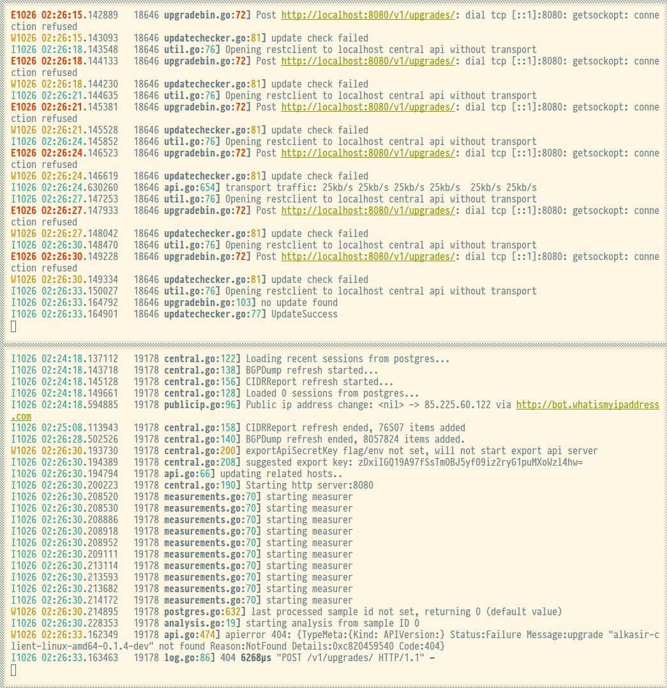

# Alkasir 2.0 overview and setup for developers

## Introduction to the main components

The components are constructed from two main technological bases which are
wither witten in Go or user facing javascript/html/browser extension.

A user runs two separate applications where one is a native binary client
written in Go and the other is a (currently chrome only) browser extension, the
client also has an internal web server which hosts the same content as the
browser extension.

The server parts are also written in Go with the exception of a small
administrative inteface wich is a Django application which currently more or
less only is a way to view the central server database.


### The most important components and repository tree locations

**Go/Native binaries:**

* [cmd/alkasir-client](cmd/alkasir-client/alkasir-client.go) - the end user
  client application.

* [cmd/alkasir-gui](cmd/alkasir-gui/alkasir-gui.go) - the end user client
  application with native platform extensions (an interactive
  tray/indicator-icon).

* [cmd/alkasir-central](cmd/alkasir-central/alkasir-central.go) - the main server software.

* [cmd/alkasir-torpt-server](cmd/alkasir-torpt-server/alkasir-torpt-server.go) -
  wrapper for tor pluggable transport server and regular socks5 proxy
  forwarder.

Generally, running one of these are not more complicated than using the
standard go tool: `go run cmd/alkasir-client/alkasir-client.go`

**Web browser stuff:**

All JavaScript+React/CoffeeScript/HTML/CSS(LESS) code is compiled to two slightly
different targets, one is an chrome browser extension and the other is packaged
into `alkasir-client` and `alaksir-gui`. Except for some browser extension
specific code the JavaScript code base is almost completely the same for both
variations.

All browser targeted source is located in [browser/script](browser/script) and
[browser/style](browser/style).

The result of the scripts are build using the two webpack configurations
[webpack.config.js](webpack.config.js) and
[webpack.chrome.config.js](webpack.chrome.config.js) which are built into
`pkg/generated` and `browser/chrome-ext/src/javascripts`


## Development environment requirements

### Required tooling

* [Go](https://golang.org/doc/install) 1.5.3 (1.5.0 will cause hanging in the
  native gui builds due to a runtime stack traversal issue between Go and C)

* (semi optional) A native C/objC compiler

The C compiler is required to build `alkasir-gui`, the native GUI version of
`alkasir-client`.

For OSX Apples own `xcode` toolchain is used, in Windows `mingw` is used and in
linux/debian/ubuntu regular GCC is used.

* Java

Java is required to run the [database migrations](central-db/changelogs) which
uses [liquibase](http://www.liquibase.org/).

* go-bindata - bakes javascript/html resources into the two client binary
  variations.

After Go is installed, go-bindata can be installed using the `go get` command
which comes with the go distribution.

    go get -u github.com/jteeuwen/go-bindata/...

* [nodejs](https://nodejs.org/en/) - Support all js/html/css front end building
  stuff.

* [webpack](https://webpack.github.io/) - Builds and bundles all js/html/css.

Webpack can be installed using [npm](https://docs.npmjs.com/) which is included
with the nodejs installer.

    npm install -g webpack

### Required support services for alkasir-central

The following services are reqired to be available

* PostgreSQL 9.4
* Redis 3

## Quickest ways to get a development environment up and running

If you are on *Linux* which supports [docker](https://www.docker.com/) the
recommended way to get up and running is to install the required tooling
mentioned above and then use [docker compose](https://docs.docker.com/compose/)
to get the required support services up and running.

To start `PostgreSQL` and `Redis` using `docker-compose`, just do this:

```sh
cd central-db
docker-compose up -d
```

For *OSX* and *Windows* a [Vagrant](https://www.vagrantup.com/)
[Vagrantfile](Vagrantfile) is provided and the recommended quick way to get started.

Vagrant will automatically configure a virtual machine with all tooling and
docker/docker-compose and start all support services at once.

After setting up Vagrant you should be able to get started by just issuing this
command:

```sh
vagrant up
```

## Sample session setting things up from scratch and starting it all using vagrant.

Issue the vagrant up command:

```sh
vagrant up
```

Enter the vagrant virtual machine:

```sh
vagrant ssh
```

Fix some file permissions

```sh
sudo chown vagrant /home/vagrant/src
```

Prepare the required services:

```sh
(. provision/docker-compose-build.sh)
```

...and...

```sh
(. provision/docker-compose-up.sh)
```


## Sample session setting things for local development on a ubuntu/debuan system

currently, this procedure requires a fairly clean ubuntu setup, some global
profile environment variables will be modified when go is installed.

Check out the source code

```sh
git clone git@github.com:alkasir/alkasir.git ${HOME}/src/github.com/alkasir/alkasir
```

Enter the workspace:

```sh
cd ${HOME}/src/github.com/alkasir/alkasir
```

Install all requirements (nodejs,docker,go,bgpdump...):

**NOTE:** This will install/modify some things at the system level, look what
all.sh does if you want to understand what is required.

```sh
(./provision/all.sh)
```

Some environment variables has been set up by the provisioning script, log in
and out again to refresh the environment.

## When an developent environment is up, start the parts.

This section continues from one of the previous scenarios.

Enter the workspace:

```sh
cd ${HOME}/src/github.com/alkasir/alkasir
```

build binaries
```sh
go install ../alkasir/cmd/...
```

Install node dependencies

```sh
make deps
npm install -g webpack  # or sudo npm install -g webpack
```

Build and package the browser parts of the code:

```sh
make browser chrome
```

Package the browser dependcies for the client builds:
```sh
make bindata
```

Run the tests to verify that everything seems to work:
```
make test-all
```

Start `alkasir-client`. The client should start and keep running, possibly
spewing out some errors about not being able to reach the central server (we
havent started that one yet)

```sh
go run cmd/alkasir-client/alkasir-client.go -authKey 0123456789ABCDEF -centralAddr 'http://localhost:8080/' -bindAddr :8899 -v 19 -logcolor -logtostderr
```

**start a new terminal** and navigate to the workspacce:

*When using vagrant:*

```sh
vagrant ssh
```

*When NOT using vagrant:*
``sh
cd $GOPATH/src/github.com/alkasir/alkasir
``

Start the support services:

```sh
(cd central-db && sudo docker-compose up -d)
```

Wait a few seconds and run the database migrations:

```sh
(cd central-db && sudo ./liquibase update)
```

Start `alkasir-central`:

```sh
go run cmd/alkasir-central/alkasir-central.go -v 19 -logcolor -logtostderr
```

After the first BGPDump refresh has finished (~1-5minutes) the server will say
it's up and the the client should stop logging that it cannot connect connect
to the server.

Now everything should be up and running and the logs should be displaying
something like this:




The development version chrome extension that was built previously can now be
added to chrome by enabling the developer mode in the chrome extensions dialog
and navigating and adding the `browser/chrome-ext/src` folder contained inside
this repository.

The extension options dialog should open, enter the following item in the
browserkey field:

    0123456789ABCDEF::8899

The alkasir chrome icon should now be lit which means that the client and
browser are connected.
